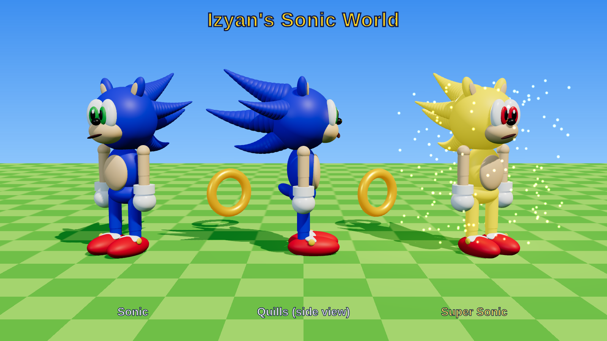

# Izyan's Sonic World

A fast, open-world Sonic-style Roblox game. Run around a big sunny island, grab gold rings,
smash robots, find all **7 Chaos Emeralds**, then collect 50 rings and turn into **Super Sonic**!



*Preview of the in-game character, rendered from the same model file the game uses.*

## Play it in 2 minutes

1. Install [Roblox Studio](https://create.roblox.com/) (free).
2. Download **`IzyansSonicWorld.rbxlx`** from this repo and double-click it (or *File → Open* in Studio).
3. Press **Play** (F5). The whole world is built by the game itself when it starts.
4. To share it with family: *File → Publish to Roblox*. Check *Game Settings → Avatar* is set to **R15** (the Sonic body is built for R15).
   Keep the game **private** or friends-only: Sonic belongs to SEGA, so this is a fan game for home, not for public release.

## Controls

| Action | Keyboard | Gamepad | Phone / tablet |
|---|---|---|---|
| Run (keeps getting faster) | WASD | Left stick | Thumbstick |
| Jump (spin ball) | Space | A | Jump button |
| Homing attack / air dash | Jump again in the air | A in the air | Jump again |
| Boost | Shift | X | **BOOST** button |
| Go Super Sonic | E | Y | **SUPER** button or **GO SUPER!** |
| Fly (Super Sonic only) | Hold Space in the air | Hold A | Hold jump |

## What's in the world

- **Start plaza** with checkered Green Hill ground and a big welcome sign
- **Loop-de-loop**: hit the dash pad and run through the loop
- **Hundreds of gold rings** everywhere; they come back after 25 seconds
- **Motobug robots**: jump, boost or homing-attack them for +5 rings. If one bumps into you, you lose 10 rings.
- **Springs** and **dash pads**, plus palm trees, sunflowers, totems and clouds
- **Glowing light beams** above each emerald, and an **arrow over Sonic's head** that points to the nearest one

### Where the Chaos Emeralds are

| Emerald | Where |
|---|---|
| Green | Top of the **Sky Islands** (ride the chain of springs) |
| Red | Peak of the **Mountain** (springs at its base) |
| Blue | **Lake island** (hop the lily pads or use the spring) |
| Yellow | Tall mesa in the **Desert Canyon** |
| Cyan | **Rocky islet** at the end of the beach pier |
| Purple | Top of the **Checker Tower** |
| White | End of the **Speedway** (dash pads, then the launch spring) |

Each emerald also gives +10 rings. With all 7 emeralds and 50 rings, press **E** / **GO SUPER!**:
Sonic turns gold, gets much faster, flies, and can't be hurt. Super form uses 1 ring per second.

## The Sonic character

Every player becomes a cartoon Sonic with a big round head, swept-back quills, big eyes,
a peach muzzle and belly, white gloves and red shoes. Super Sonic turns gold with red eyes.

The body is made of rounded parts listed in `src/shared/SonicModel.json`, welded onto the
normal Roblox R15 skeleton (which is hidden), so the usual running and jumping animations
still work. To change the look, edit `tools/make_sonic_model.py` and run
`python3 tools/make_sonic_model.py` to regenerate the JSON. The game ignores players' own
avatar items so everyone gets the same Sonic.

## Tweaking the game

Everything you might want to change is in `src/shared/Config.lua`: speeds, jump height,
how many rings Super Sonic needs, sounds and music. To add music, find a track in the
Creator Store and set `Music = "rbxassetid://<id>"`.

## Project layout (for developers)

This is a [Rojo](https://rojo.space/) project: the code lives in plain files so it works with Git.

```
src/
  shared/Config.lua                 tuning values (ReplicatedStorage.Shared)
  server/Main.server.lua            rings, emeralds, Super Sonic, robots (ServerScriptService)
  server/WorldBuilder.lua           builds terrain, lighting, zones, rings, gimmicks
  shared/SonicModel.json            the Sonic body shape (generated by tools/make_sonic_model.py)
  server/SonicLook.lua              builds the Sonic body on each player + golden Super form
  server/Badniks.lua                patrolling Motobug robots
  client/SonicController.client.lua movement, boost, homing attack, springs, loop, pickups
  client/HUD.client.lua             ring counter, emerald tracker, quest text, speed meter
```

To rebuild the place file after editing code: `rojo build default.project.json -o IzyansSonicWorld.rbxlx`.
To live-sync into an open Studio session: `rojo serve` plus the Rojo Studio plugin.

Tip: in Studio, select **Workspace → Terrain** and tick **Decoration** to get animated grass blades.
